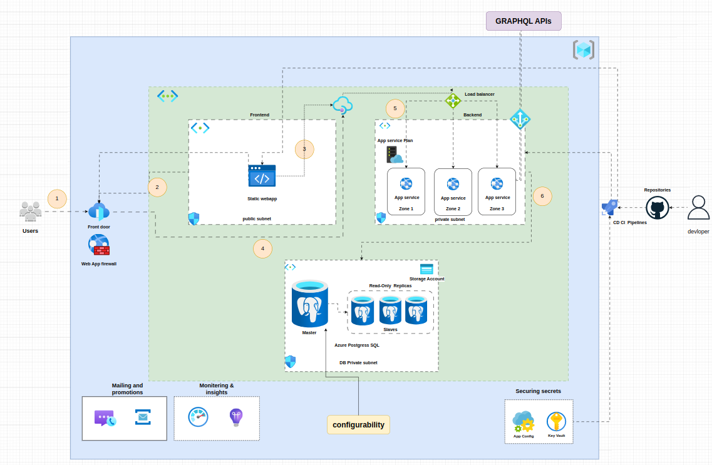
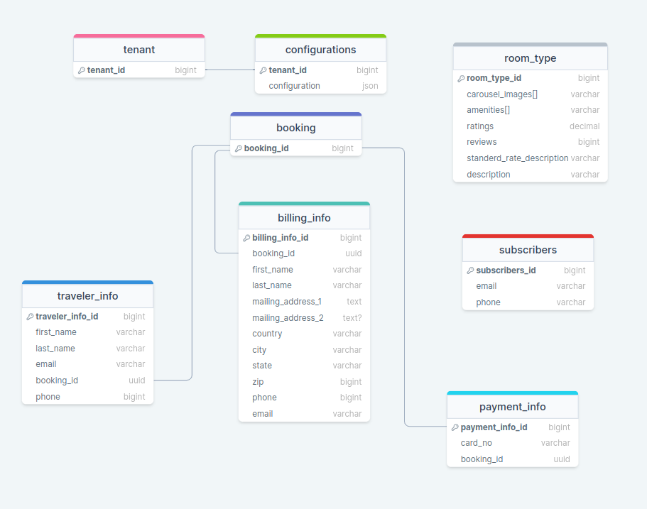
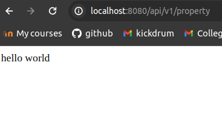
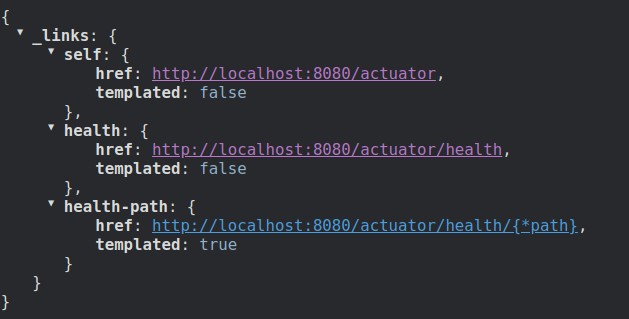
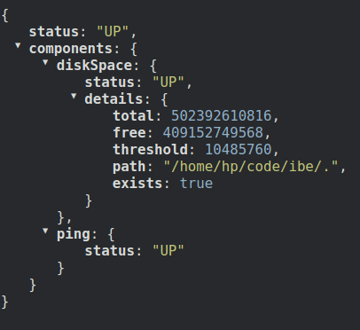
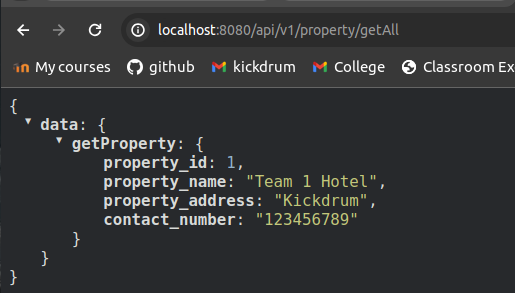

# SCRUM-3 - Backend Repository Setup
### in this sprint task we need to setup the backend for our IBE project .
## Tasks
- initialize backend spring project with required dependecies
- multi environment setup in spring boot
- setup health endpoint
- basic testing setup with Junit
- Graphql integration in backend
- demo endpoint to showcase GraphQL API call

## Azure Cloud Architecture

## DB Schema

## Result Screenshots
### Hello Endpoint

### Health endpoint

### Graphql query integration

