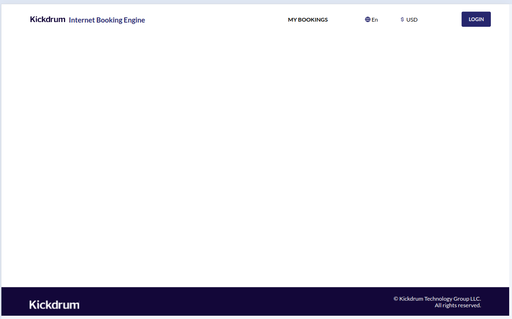
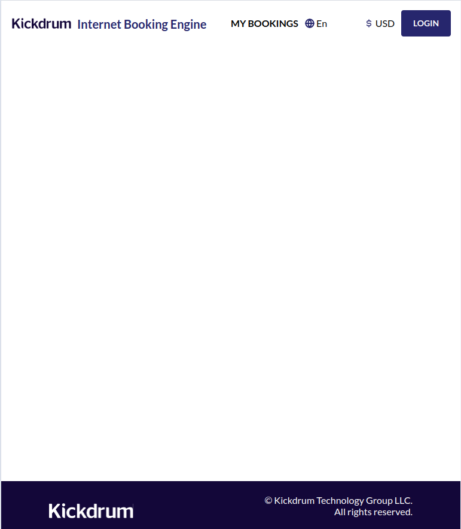
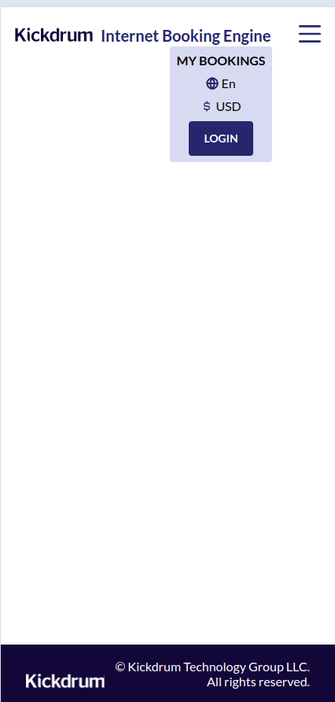
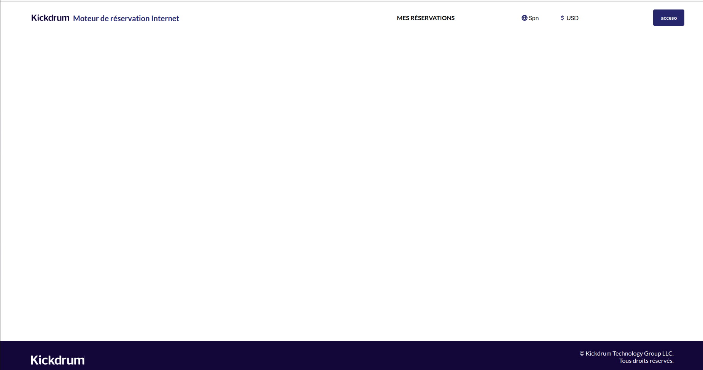
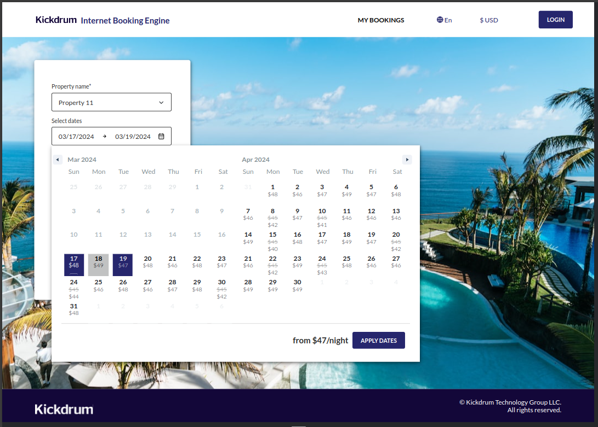
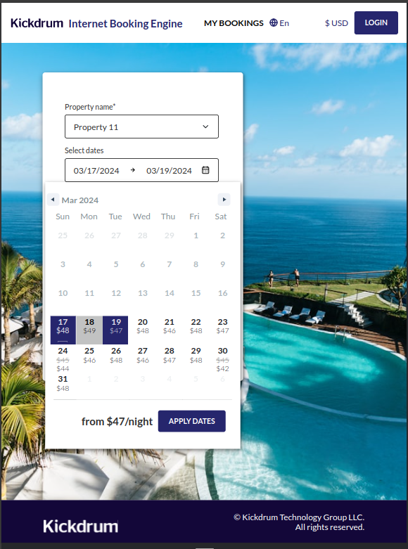
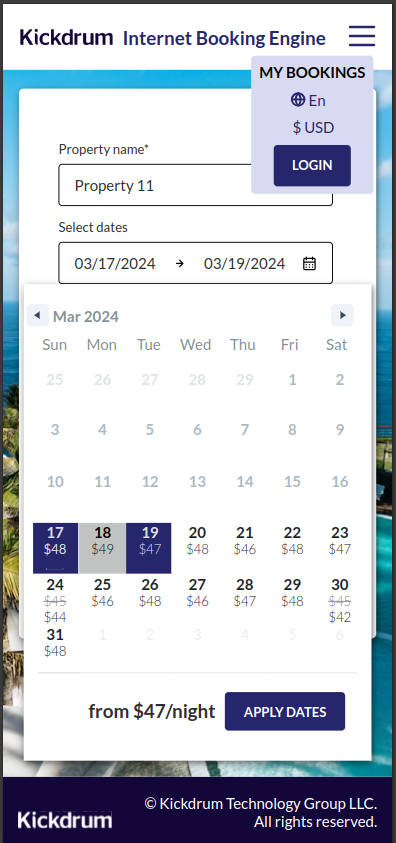
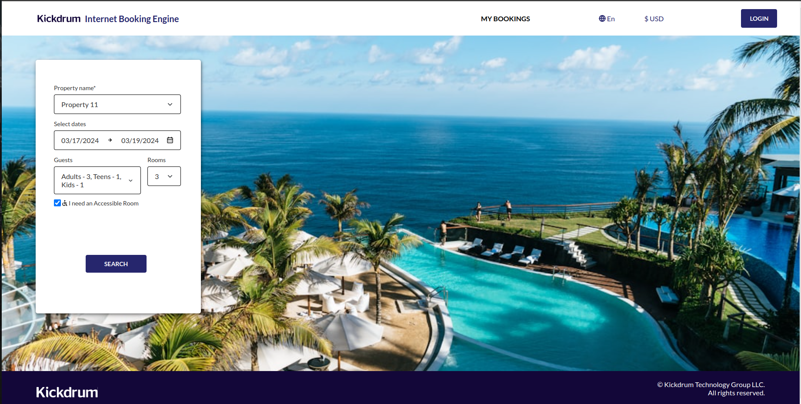
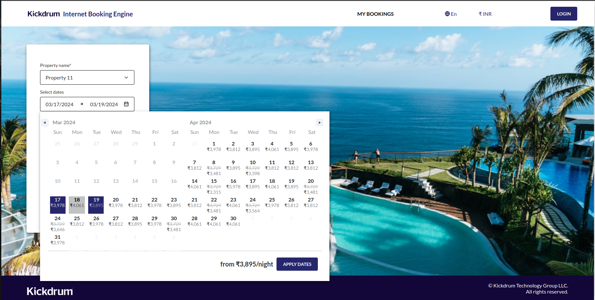
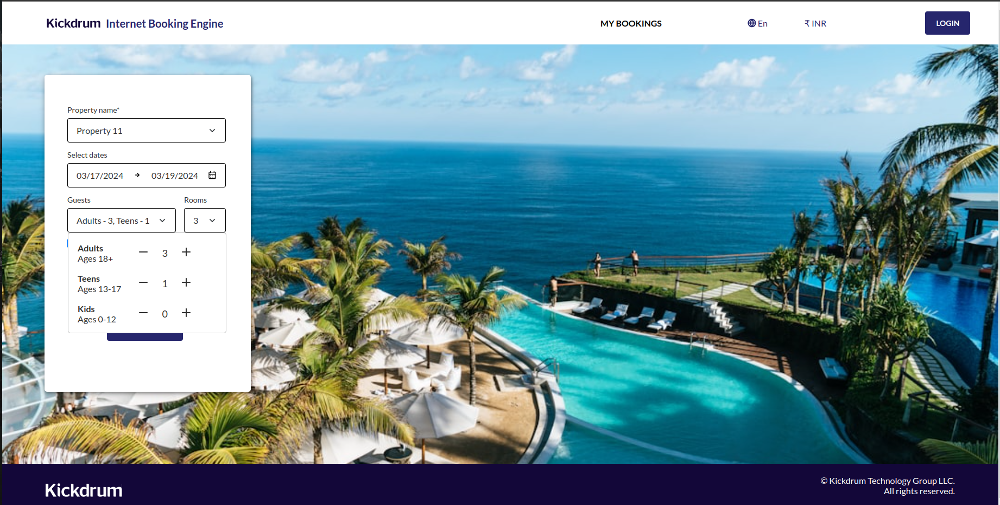

# Internet Booking Engine

## Steps to Run
1. Run `npm i` to install dependencies.
2. Run `npm run dev` to start the development server.

## SPRINT 1

## Frontend Setup
- React APP Created
- Sentry Setup Done
- React Router Setup Done
- Redux Setup Done
- Cypress Setup Done

## Landing Page
- Header and Footer components completed.

### Laptop View
- **Resolution:** 1440 x 884

### Tablet View
- **Resolution:** 768 x 884

### Mobile View
- **Resolution:** 425 x 884

## English Language Selected

## Spanish Language Selected

## IBE TEAM 12 Frontend
- this is frontend repository for frontend

## SPRINT 2

### Tasks
- Landing Page UI - Rate Calender
- Minimum Nightly Rate From Backend with Promotions and Currency conversion
- Handling Configurability on Landing Page 

### Laptop View(1440 x 1024)

### Tablet View( 768 x 1024)

### Mobile View(425 x 896)

### Filters UI Screenshot

## IBE TEAM 12 Frontend
- this is frontend repository for frontend

